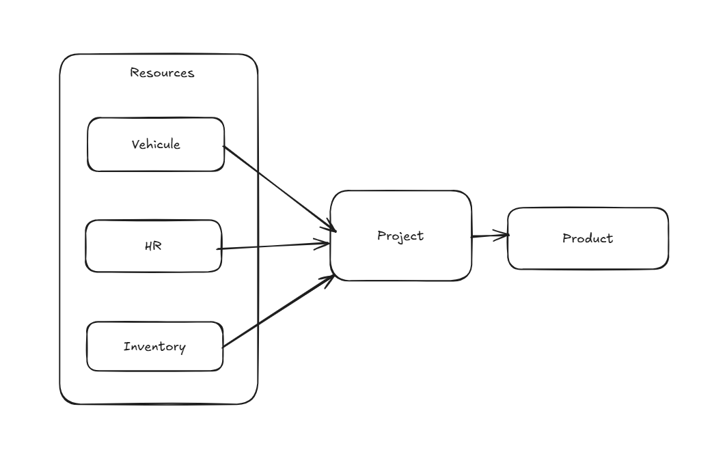
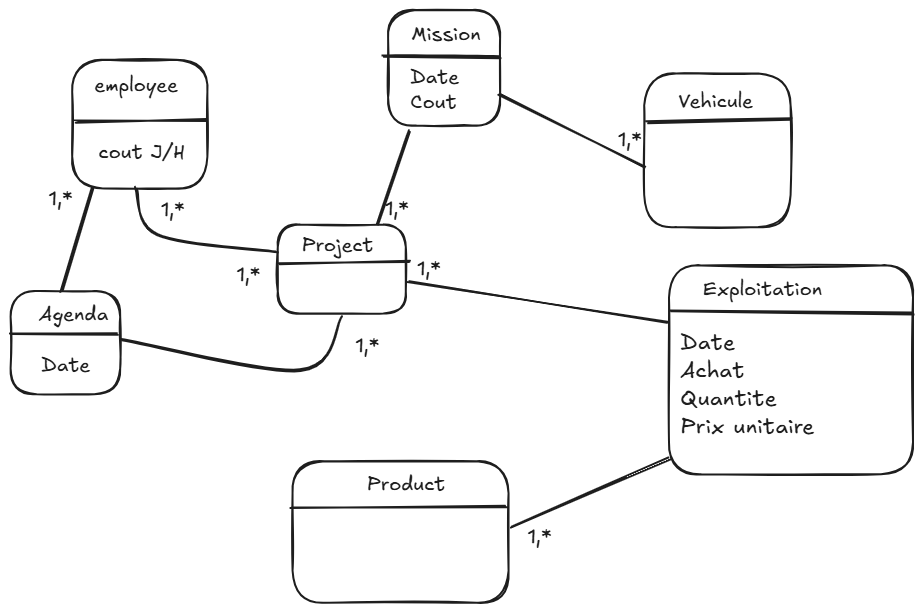

# Construction Management Module for Odoo

## Overview
The **Construction Management Module** is a custom Odoo module designed to manage the physical aspects of construction projects. It streamlines the management of resources such as employees, materials, and vehicles, providing real-time cost tracking and ensuring accurate project expense monitoring.

### Key Features
- **Product Management**:
  - Manage construction materials with daily usage costs.
  - Track materials sourced through the purchase process.
- **Employee Management**:
  - Assign employees to projects with defined hourly/daily rates and roles (e.g., architect, foreman, laborer).
- **Vehicle Management**:
  - Track vehicles assigned to projects, each with variable daily costs.
- **Cost Tracking**:
  - Generate real-time updates of total project costs for materials, employees, and vehicles.
  - Maintain an accurate overview of construction expenses.
- **How is it suposed to work**:


---

## Installation

### Prerequisites
Ensure that you have Odoo installed on your system. This module requires the following dependencies:
- `project`: To manage construction projects.
- `purchase`: For handling material purchases.
- `hr`: To manage employees and roles.
- `fleet`: For vehicle management.
- `account`: For cost calculations and reporting.

### Steps
1. Check and update your Odoo configuration file (`odoo.conf`) to include the path to the `addons` folder where you cloned the repository and the other instructions on (`odoo.conf.txt`).
2. Restart your Odoo server to load the new module.

   If using Docker:
   ```bash
   docker-compose restart
   ```
3. Activate Developer Mode in Odoo:

    Navigate to Settings > Activate Developer Mode.
    Install the module:

4. Go to Apps, search for "Construction Management," and click Install.

## usage:

### Step 1: Create a Project
- Navigate to the Projects app.
- Click Create and enter details for the construction project.
- Save the project.
### Step 2: Add Resources to the Project
- **Products**:
  - Add construction materials with their daily costs.
  - Navigate to the "Products" tab within the project.
- **Employees**:
    Assign employees to the project and define their daily/hourly rates and roles.
- **Vehicles**:
    Assign vehicles to the project and define their daily costs.
### Step 3: Monitor Costs
- View the total project cost in real-time from the project form view.
- Use the project dashboard to analyze and update resource usage and associated expenses.

## Folder Structure

```bash
addons/
└── constructionManagement/
    ├── models/
    │   ├── __init__.py
    │   ├── employee_project.py
    │   ├── exploitation.py
    │   ├── mission.py
    │   ├── project.py
    │   ├── product.py
    │   ├── employee.py
    │   ├── vehicle.py
    ├── views/
    │   ├── employee_project_view.xml
    │   ├── exploitation_view.xml
    │   ├── mission_view.xml
    │   ├── project_view.xml
    │   ├── product_view.xml
    │   ├── employee_view.xml
    │   ├── vehicle_view.xml
    ├── security/
    │   ├── ir.model.access.csv
    ├── static/
    │   └── description/
    │       ├── icon.png
    ├── __manifest__.py
    └── __init__.py
```
## The UML of the project:
### Use case diagram:

### Class diagram:

